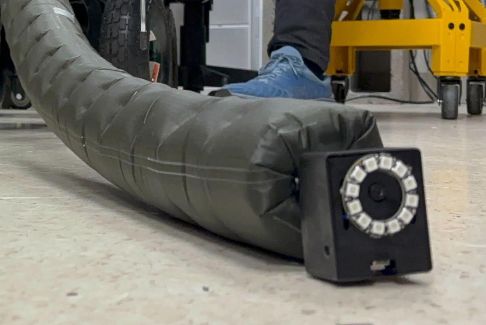

<html lang="en-US">
<head>
  <meta charset="UTF-8">
  <meta name="viewport" content="width=device-width, initial-scale=1.0">
  <!--<link rel="stylesheet" href="style.css">-->
  <title>Gotta Grow Fast: Optimized Tip Mount & Benchmarking Methods for Growing Vine Robots</title>
</head>
<body>
  

    

      <h1>Gotta Grow Fast: Optimized Tip Mount & Benchmarking Methods for Growing Vine Robots</h1>
    

    

        <strong>
          Anonymous Authors
        </strong>
      <!-- 

        <strong>
          <a href="https://nhanson.io/">Nathaniel Hanson1,2*</a>, 
          Austin Allison1*, 
          Charles DiMarzio1, 
          <a href="https://www.tpadir.info/">Taşkın Padır1,3</a>, 
          <a href="https://www.kristendorsey.com/">Kristen L. Dorsey1</a>
        </strong>
      

      

        1Northeastern University, 
        2MIT Lincoln Laboratory, 
        3Amazon Robotics
      

      
∗These authors contributed equally

      
Correspondence: nhanson2 [@] mit [.] edu
 -->
    

  

  <video width="600" controls>
    <source src="media/gotta_grow_fast_v2.mp4" type="video/mp4">
  </video>

  <h2>Abstract</h2>
  

  Soft, growing vine robots extend through tip eversion, a mechanism that enables navigation through cluttered environments. However, integrating cameras and other sensors at the tip is uniquely challenging because the material forming the tip is constantly renewed as the robot grows. This continual material turnover, combined with friction between internal layers, added tip weight, and fabric constriction, complicates sensor and tool mounting. These limitations hinder the deployment of vine robots for inspection and search tasks, where rapid growth while carrying tip-mounted sensors is essential.
  In this work, we present a triangular roller tip mount that reduces internal resistance during growth by rolling rather than sliding against the robot body. The design was refined through iterative failure analysis, enabling, for the first time, consistent eversion on a TPU-coated ripstop nylon vine robot.
  To quantitatively evaluate mount performance, we introduce a custom testbed that isolates tip-mounting effects by measuring tail tension during eversion. Comparative experiments across multiple mount variants, including prior designs, show that our triangular roller mount achieves the lowest tail tension and most repeatable growth performance.
  These results establish both a validated tip-mount design and a repeatable benchmarking framework for advancing sensor and tool integration in soft growing robots.
  

  

    <figure>
      
      <figcaption>Mount Overview</figcaption>
    </figure>
  

</body>
</html>
---